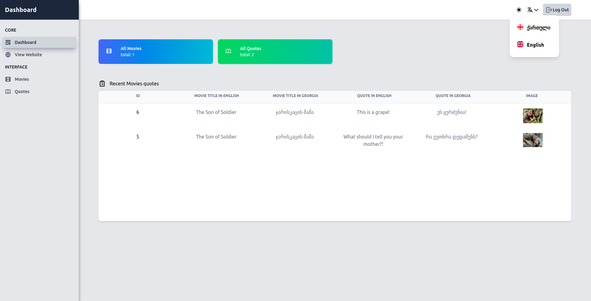

## Table of Contents

* [ About The App](#about-the-application)
* [ Prerequisites ](#prerequisites)
* [ Package](#package)
* [ Install ](#install)
* [ Setup ](#project-setup)
* [ Resources](#resources)


<a name="about"></a>

## About the application

Movie Quotes is a website where you can browse the website and view a random movie quote. Also go to the random movie page and see the famous quote from this movie. The website has a multilingual function, it is English and Georgian.

## App looks like 



## Prerequisites


| #        | NAME     | VERSION        | Check Version |
| :---     | :---:    |     :---:      |       :---: |
|          | <a href="https://nodejs.org/en/" target=_blank>node</a>     | ^16.13.0     | node -v     |

## Install

Downoad [ZIP](https://github.com/davitlabadze/movie-quotes-vue/archive/refs/heads/master.zip) or Clone:
 ``` 
git clone https://github.com/davitlabadze/movie-quotes-vue.git
```


## Project Setup

```sh
npm install
```

### Compile and Hot-Reload for Development

```sh
npm run dev
```

### Compile and Minify for Production

```sh
npm run build
```

### Run Unit Tests with [Vitest](https://vitest.dev/)

```sh
npm run test:unit
```

### Run End-to-End Tests with [Cypress](https://www.cypress.io/)

```sh
npm run build
npm run test:e2e # or `npm run test:e2e:ci` for headless testing
```

### Lint with [ESLint](https://eslint.org/)

```sh
npm run lint
```

##  Resources  
* [Figma Designs](https://www.figma.com/file/IIJOKK5esgM8uK8pM3D59J/Movie-Quotes?node-id=0%3A1)
* [TailwindCss](https://tailwindcss.com/docs/guides/laravel)
* [Backend](https://github.com/RedberryInternship/davitlabadze-movie-quotes.git)


